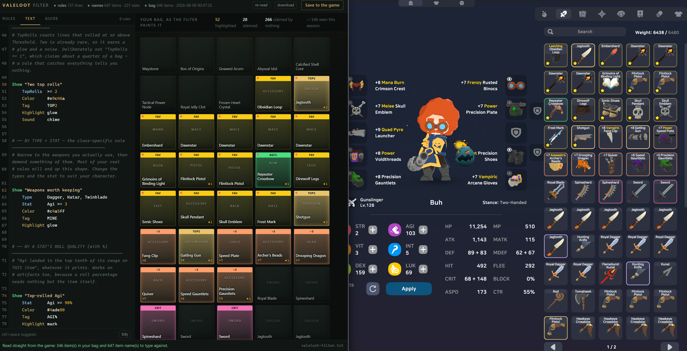

# ValeLoot

**A loot filter for SpiritVale, inside the game.** You write rules in a text file; ValeLoot colours your
inventory cells by those rules, tells you which rule claimed an item when you hover it, and plays a sound
when a matching item is picked up.

It is complete on its own. No companion app, no server, no account, nothing to sign up for.

> ### ⬇ [Download ValeLoot 0.2.1](https://github.com/bjb2/valeloot/releases/download/v0.1.0/ValeLoot-0.1.0-with-BepInEx.zip](https://github.com/bjb2/valeloot/releases/download/v0.2.1/ValeLoot-0.2.1-with-BepInEx.zip)
>
> Unzip it into your SpiritVale folder, launch the game, press **F8**.
>
> **The first launch takes a few minutes.** BepInEx has to unpack the game once before any mod can
> read it, and it only does that the first time. The game may sit on a black window or look frozen
> while it happens — leave it alone. Every launch after that is normal speed.
>
> **Not the green "Code → Download ZIP" button.** That gives you the source code — a folder called
> `valeloot-main` full of `.cs` files, which the game cannot load. You want the link above, or the
> [releases page](https://github.com/bjb2/valeloot/releases/latest).



*Left: the editor, and your rules as text. Middle: what those rules do to your bag. Right: the game's own
inventory, with the same cells lit the same colours. `TOP2` is two top rolls, `AGI%` is a top-rolled Agi,
`FAV` is a favourite, `CRIT` is high crit — all from the rules shown on the left.*

---

## Read this first

**It does not automate anything.** ValeLoot changes how loot *looks and sounds* to you. It does not pick
anything up, sell, salvage, refine, move, equip or click anything, and it never plays the game for you.
Every decision in the game remains yours, made by hand, at the same speed as before. What it does is put
the information you already have where you can see it: a colour on a cell, a line on a tooltip, a noise
when something good lands.

Concretely, it draws overlays and plays audio cues. That is the entire feature set.

**It is provided as is.** No warranty, no guarantee that it works, no promise of support or updates, and no
assurance it will survive the next game patch. Nobody has endorsed it. If you install it, you accept that
you are responsible for your own account and your own machine. That is not boilerplate — see *The
developer's stance* below.

## What it does

- **Colours your inventory cells** by your own rules, at three intensities: `dot` (barely lit), `mark`
  (clearly lit), `glow` (unmistakable, and it animates). The colour is whatever `#rrggbb` you wrote.
- **Names the rule on hover.** The item tooltip gains one line, in that rule's colour, saying which of
  your rules claimed the item. Your rule's own name is the explanation, because you wrote it.
- **Plays a sound when a matching item is picked up** — bag open or closed, once per pickup. Every bag:
  gear, artifacts, cards, gems, consumables and junk. See *Good to know*.
- **Reloads while you play.** Save your rules and the bag recolours on the next inventory redraw. No
  restart, no relog.
- **Comes with an editor.** Press `F8` in game and your browser opens on it, already showing your real bag.

## What it does NOT do

- No automation of any kind. It does not pick up, sell, refine, salvage, move or equip anything.
- No input simulation. It does not click, type, aim or move for you.
- No game commands. It sends the game nothing at all.
- No packet capture. It does not hook, read or touch the game's network traffic, and there is no code path
  by which it could.
- Nothing leaves your machine. No telemetry, no uploads, no account, no phoning home.

That is a **scope boundary with a reason**, not a list of unfinished features. The game's staff have said
client-side tools that change how loot looks are allowed and nothing beyond that is — so the rule language
has no verb that acts on an item, and the plugin carries no code that could carry one out if it did. The
absence is the design.

You can verify most of this in a minute, and you should: clone the repo and grep for `Socket`, `HttpClient`
and `System.Net`. The only thing you will find is the editor's loopback server, described below.

## The developer's stance, quoted exactly

Game staff, replying publicly about a loot-presentation tool:


**Allowed is not endorsed.** Nobody has approved this mod, nobody is going to, and if something goes wrong
with your account that is on you. The same warning prints in the log every time the game starts with
ValeLoot installed.

---

## Install

Take **`ValeLoot-x.y.z-with-BepInEx.zip`** from the releases page.

1. Unzip it into your SpiritVale folder — the one holding `SpiritVale.exe`. When it is right,
   `SpiritVale.exe`, `winhttp.dll` and a `BepInEx` folder all sit side by side.
2. Launch the game — **and be patient the first time.** See below.
3. Press `F8`.

### The first launch is slow. That is normal.

Before any mod can read the game, BepInEx has to unpack it once — it writes a few hundred files into
`BepInEx/interop/`, and that takes **a few minutes on a first run**. The game may sit on a black window,
or look like it has hung, or Windows may grey it out and say "not responding". Leave it. It only happens
once; every launch afterwards is normal speed.

This is the single most likely reason to think ValeLoot is broken when it is not. If you close the game
during that first unpack, nothing will have loaded and it will look exactly like a failed install.

You can watch it happen if you want reassurance: `BepInEx/LogOutput.log` grows while it works, and
`BepInEx/interop/` fills up with files.

That is the whole install. BepInEx is included, unmodified, because picking the wrong BepInEx build is the
commonest way to fail at installing a mod like this: BepInEx 5 and the *stable* 6 release do not load
plugins into an IL2CPP game, and the download page does not make that obvious. Bundling removes the choice.

Already running BepInEx 6 IL2CPP? Take the plain `ValeLoot-x.y.z.zip` instead — it is the plugin alone, and
it will not touch your existing install.

To uninstall, delete `BepInEx/plugins/ValeLoot/`. Your rules and sounds stay in `BepInEx/config/` in case
you come back.

## Writing rules

Rules live in `BepInEx/config/valeloot-filter.txt`, and a worked example ships in it. The language is a
deliberate lift from the loot filters players already know from Path of Exile and Diablo: an **ordered list
where the first match wins**, so specific rules go at the top and broad ones at the bottom, and you never
have to think about overlap — only about priority.

```
Threshold 90

Show "Two top rolls"
    TopRolls  >= 2
    Color     #e9c46a
    Tag       TOP2
    Highlight glow
    Sound     chime

Show "Weapons worth keeping"
    Type      Dagger, Katar, Twinblade
    Stat      Agi >= 3
    Color     #c4a5ff
    Highlight glow

Hide "vendor trash"
    AvgRoll   < 35
    TopRolls  < 1
```

| Condition | Asks |
|---|---|
| `Name Kunai` | part of the item's name, or its id |
| `Type Dagger, Katar` | the item's type; comma-separated means any of them |
| `TopRolls >= 2` | how many lines rolled at or above `Threshold` |
| `AvgRoll < 35` | average roll quality across its lines, in percent |
| `Stat Agi >= 90%` | that stat's line rolled in the top tenth of its range |
| `Stat Agi >= 3` | that stat *prints* at least 3 on this item |
| `OverRoll` | a line above its normal maximum — only a Chaos widen does that |
| `Refine >= 5` | refine level at least this |
| `Favorite` | the star you put on it in game |
| `AlwaysShow "…"` / `AlwaysHide "…"` | one item by name, ignoring rule order entirely |

**The `%` is a real distinction.** `Stat Agi >= 90%` asks how *well* the line rolled;
`Stat Agi >= 3` asks what it *prints*. They are different questions with different answers: a 0% roll
already prints two thirds of the maximum, so on an attribute that caps at 3, `>= 3` means maxed while
`>= 90%` means genuinely lucky.

You never have to guess a spelling. ValeLoot writes every item and stat name the game knows to
`valeloot-items.txt`, and refreshes it when the game gets new content.

### Per-class examples

Four starting points in [`examples/`](examples), each built from a public guide in the
[SpiritValers build library](https://spiritvalers.com/builds) — the gear that build actually wears and
the stats it actually leans on:

| File | Based on | Hunts for |
|---|---|---|
| [`berserker-cyclone.txt`](examples/berserker-cyclone.txt) | *(Cyclone) Lv1 to 150 Comprehensive Guide* by grindenjoyer | Str on two-handers, attack speed, pre-refined gear |
| [`priest-support.txt`](examples/priest-support.txt) | *Priest - Zero to Hero* by ragnarok | Vit, Int on wands, shields — a wall, not a damage dealer |
| [`gunslinger-crit.txt`](examples/gunslinger-crit.txt) | couc9527's launcher build | Dex on guns, and crit **damage** over crit rate, since that build is already capped |
| [`wizard-frost.txt`](examples/wizard-frost.txt) | *Frost Mage - Tower/Bossing* by danc9399 | Int, casting weapons, MP for long tower runs |

Copy one over your `valeloot-filter.txt` and edit from there. They are meant to be argued with — your
build is not that build.

## The editor

`F8` opens it. There is nothing to install and no folder to choose — the mod serves the page itself, so it
already knows your bag, your rules and the game's item catalog.

- Your **real bag**, drawn as the game draws it, tinted by whichever rule claimed each cell.
- Your rules as a **numbered cascade**, because first-match-wins means order is the filter. Drag to
  reorder and watch the colours move.
- **Point at a rule** and the bag dims so you can see exactly which items it took — not "15 items", but
  *which* fifteen.
- **Click an item** to build a rule from it, or to pin or silence that one item.
- Counts, share, and an honest note when a rule claims nothing because a rule above it got there first.
- A **text tab**, for power users and for sharing a filter with someone else.

Saving writes `valeloot-filter.txt` and your bag recolours on the next inventory redraw.

### The one port it opens

The editor is served from the mod over loopback, on `http://127.0.0.1:38512/`.

- It binds **`127.0.0.1` only**. It is reachable from this machine and from nothing else.
- It serves exactly three things: its own editor page, your own rule file, and the bag/catalog data the
  page draws. It carries **no game traffic**, and there is no network hook anywhere in the plugin.
- Nothing leaves your machine.
- Turn it off with `Enabled = false` under `[Editor]` in `BepInEx/config/com.savi.valeloot.cfg`. No port is
  opened, and `F8` then opens a local copy of the editor as a plain file instead. Everything else keeps
  working; the editor is a convenience, and highlighting is the product.


## Settings

`BepInEx/config/com.savi.valeloot.cfg`, created on first run.

| Setting | Default | What it does |
|---|---|---|
| `Highlight / TintCell` | `true` | Colour the cell. Off leaves the game's own plain highlight; the hover note still works. |
| `Highlight / TintDepth` | `2` | How deep to colour. Only change this if cells stop colouring after a game update. |
| `Highlight / HoverNote` | `true` | The tooltip line naming the matched rule. |
| `Sound / Enabled` | `true` | Sounds on pickup. |
| `Editor / Enabled` | `true` | The loopback editor server. |
| `Editor / Port` | `38512` | Its port. |
| `Editor / Hotkey` | `F8` | Any `UnityEngine.KeyCode` name. |

Sounds are ordinary `.wav` files in `BepInEx/config/valeloot-sounds/`. Five are written on first run so a
fresh install has something to play; overwrite `chime.wav` with anything you like and your rules do not
change.

**Anything you drop in that folder becomes an option.** Put `poe-insane.wav` there and write
`Sound poe-insane`; the editor's sound picker lists it the moment it appears, and the ▶ button plays the
real file rather than an approximation. No restart, and nothing to register anywhere.

ValeLoot ships no audio beyond those five synthesised tones, on purpose — it would mean redistributing
somebody else's work in a repository that cannot license it. If you want the loud, tiered
Path-of-Exile-style alerts, people share packs for exactly this; one doing the rounds is
[Path of Exile-style drops for RuneLite (sounds)](https://www.reddit.com/r/2007scape/comments/1mk6dv8/path_of_exilestyle_drops_for_runelite_sounds/).
Drop the `.wav` files in `valeloot-sounds/` and name them in your rules. Check what you are allowed to do
with any pack you download; that is between you and whoever made it.

## Good to know

- **Every bag makes noise.** Equipment, artifacts, cards, gems, consumables, cosmetics and junk all ping
  when you pick them up, and a card or a lure you already own counts, because a second copy is still a
  drop. Nothing is excluded by kind — your rules decide what is worth hearing about.
- **One rule, several names.** `Name "Buzzing Hive Fragment", "Abyssal Idol"` matches either one. `Type`
  reads as a list too, and `Type Card, Gem, Consumable, Junk` claims whole kinds at once.
- **Names work even when the id doesn't look like one.** ValeLoot reads the game's own configs, so
  `Name "Abomination Card"` finds the card the game calls `Abomination`, and `Name "Buzzing Hive
  Fragment"` finds `Lure Sting`. Both columns are in `valeloot-items.txt`.
- **Only equipment rolls substats.** `Stat`, `TopRolls`, `AvgRoll` and `OverRoll` never match a card, gem,
  consumable or junk. Use `Name`, `Type` or `Favorite` for those.
- **The editor's bag fills in as you scroll.** It shows what it has seen since you logged in, so if the grid
  looks short, open your bag and scroll once.
- **`Stat Agi >= 3` needs a second after you log in.** If a rule like that looks wrong the moment you get
  in, reopen your bag. `Stat Agi >= 90%` never has this problem.
- **Artifacts have no `Type`.** Match them on rolls, refine or name instead.
- **Ten items at once make one noise**, not ten. A rule with no conditions claims your whole bag and will
  chime at everything — that is the one way to turn this into a metronome, and it is your own doing.

## When a game update breaks it

It will, eventually. ValeLoot finds the game's inventory by name, and an update can rename things.

If your bag stops lighting up after a patch, the fix is usually a new release rather than anything you can
change. What helps is a copy of `BepInEx/LogOutput.log` — ValeLoot prints exactly what it found and what it
didn't at startup, so a `MISS` in there names the broken part immediately. Paste it into an issue and that
is enough to work with.

## Building it yourself

```
dotnet build                      # the plugin
bun run build:editor              # the editor page (committed, regenerate after editing it)
dotnet build -t:Package           # the plugin-only zip
dotnet build -t:PackageBundle     # the unzip-and-play zip, BepInEx included
```

No game install is needed to build: the mod resolves everything by name at runtime and references only the
BepInEx NuGet package.

## Licence

MIT — see [LICENSE](LICENSE). BepInEx is bundled in the "with BepInEx" download, unmodified, under
LGPL-2.1; its licence and a link to its source are in `NOTICE.txt` at the root of that zip.
